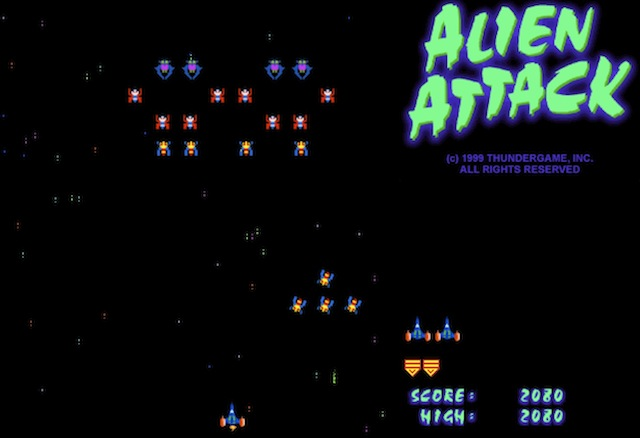

Alien Attack
===========

This is my version of the classic video game Galaxian.

It appears here as an Eclipse Java project.

Use the arrow keys to move your ship left and right; press 'f' to fire.

I've intentionally tried to capture the flavor of the original game by having the aliens
move in a 'rippling' fashion.  This was done in the original (I assume) since the hardware
was not powerful enough to update more than a small number of  aliens in each animation frame.

Loading the page "Applet.html" within a browser should start the program.
Failing that, from a command line you can try "appletviewer Applet.html".
The game can also be found at [this page](http://www.cs.ubc.ca/~jpsember/sfu/arain.html).

